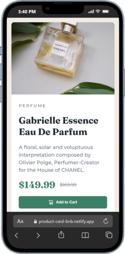
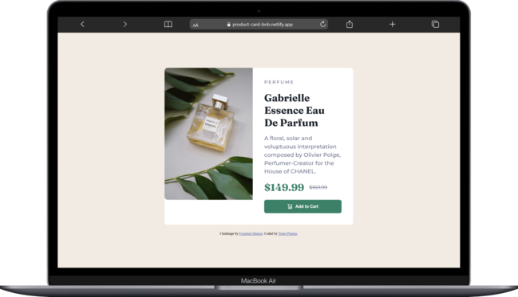

# Product Preview Card Component

This project is a responsive product preview card built as part of a Frontend Mentor challenge.
It presents a CHANEL Gabrielle Essence Eau De Parfum product with its image, description, price, and a call-to-action button.

The goal of this project was to practice clean layout composition, responsive design, and consistent use of CSS custom properties for theming.

## Table of contents

- [Overview](#overview)
  - [Screenshot](#screenshot)
  - [Links](#links)
- [My process](#my-process)
  - [Built with](#built-with)
  - [What I learned](#what-i-learned)
  - [Continued development](#continued-development)
  - [Useful resources](#useful-resources)
- [Author](#author)
- [Acknowledgments](#acknowledgments)

## Overview

A responsive product card that adapts seamlessly between mobile and desktop screens.
It includes a product image, title, description, price comparison, and an “Add to Cart” button — designed to showcase effective use of Flexbox and modern CSS variables for layout and color management.

### Screenshot

**Mobile Version**

**Laptop Version**

### Links

- Solution URL: [Product card solution](https://www.frontendmentor.io/solutions/product-card-component-2zUGKiMuV0)
- Live Site URL: [Product card live](https://product-card-bnb.netlify.app/)

## My process

### Built with

- Semantic HTML5 – structured content for accessibility and clarity
- CSS3 – leveraging custom properties (variables) for maintainable design
- Flexbox – for alignment and layout responsiveness
- Media queries – to switch between mobile and desktop layouts
- Google Fonts – Fraunces and Montserrat for visual contrast and typography hierarchy

### What I learned

- How to structure a two-column layout that adapts responsively using Flexbox and media queries.

- Effective use of the picture element for serving optimized images based on screen size.

- Maintaining design consistency through CSS custom properties and reusable typographic rules.

### Continued development

- Extending the layout concept into a small product grid or e-commerce preview page.

### Useful resources

- [Media Queries](https://www.youtube.com/watch?v=yU7jJ3NbPdA) - This video helped clarify how media queries work and how to make layouts responsive across different screen sizes.

## Author

- Website - [Tiago Pereira](https://social-links-buildandbreak.netlify.app/)
- Frontend Mentor - [@BuildAndBreak](https://www.frontendmentor.io/profile/BuildAndBreak)
- Linkedin - [Tiago Pereira](https://www.linkedin.com/in/tiago-pereira-5a4698289/)
- Github - [@BuildAndBreak](https://github.com/BuildAndBreak)

## Acknowledgments

Thanks to [@WebDevSimplified](https://www.youtube.com/@WebDevSimplified) for his clear explanations about responsive design concepts and media queries, which were instrumental in understanding how to structure the layout for this challenge.

Thanks to the Frontend Mentor team for providing high-quality, well-structured challenges that help developers improve their coding skills in a practical way.
